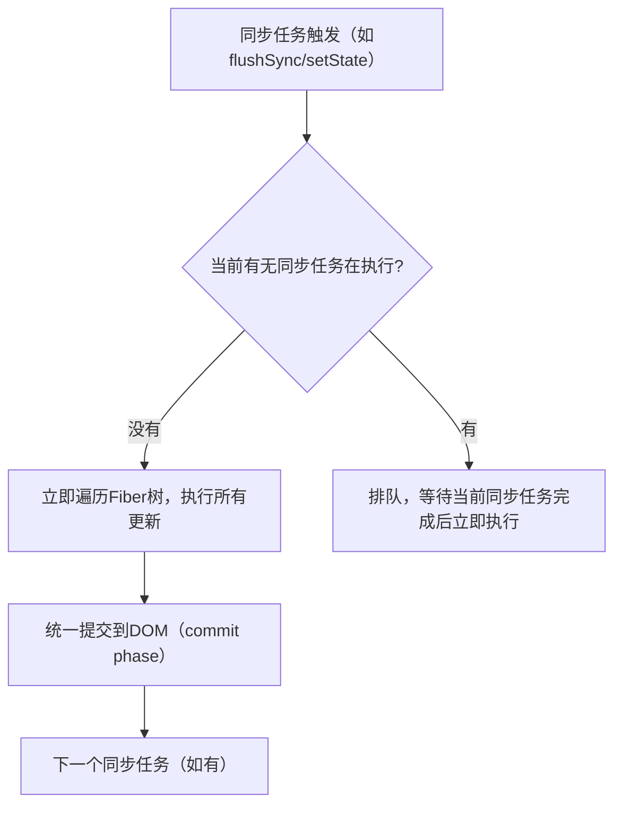
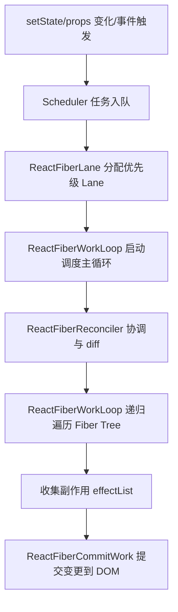
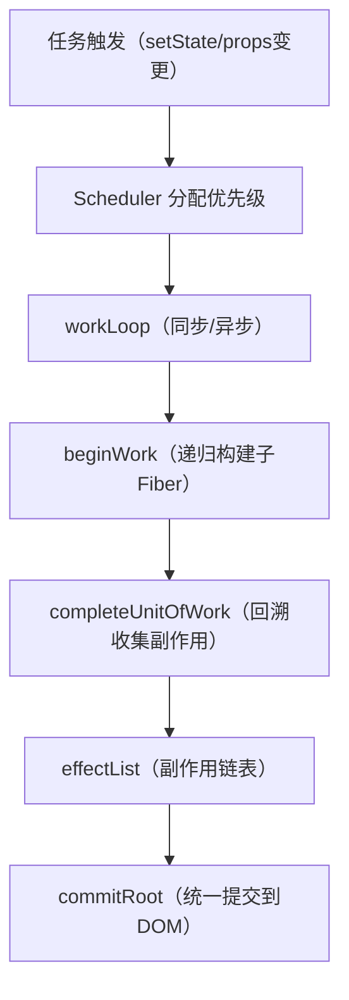

import { Meta } from "@storybook/addon-docs";


<Meta title="Hundun/React/React-Fiber" />

# React Fiber 详解

## 1. Fiber 的设计动机

- 解决 React 15 及以前 Stack Reconciler 的同步递归、无法中断、卡顿等问题。
- 支持异步渲染、优先级调度、任务分片、动画流畅、响应用户交互。
- 为未来特性（如 Suspense、Concurrent Mode、时间分片）打基础。

---

## 2. Fiber 的核心概念

- **Fiber**：React 16 引入的核心数据结构，本质是一个 JS 对象，表示虚拟 DOM 树中的一个节点。
- **Fiber Tree**：由 Fiber 节点组成的树，映射组件树结构。
- **Work Loop**：调度和执行 Fiber 节点的主循环。
- **任务分片**：将渲染任务拆分为小单元，允许中断和恢复。
- **优先级（Lane）**：不同任务可分配不同优先级，保证高优先级任务先执行。

---

## 3. Fiber 数据结构

每个 Fiber 节点包含：
- `type`：组件类型（函数/类/原生标签）
- `key`：唯一标识
- `child`：第一个子 Fiber
- `sibling`：下一个兄弟 Fiber
- `return`：父 Fiber
- `stateNode`：对应的真实 DOM 或组件实例
- `pendingProps`/`memoizedProps`：新旧 props
- `memoizedState`：state
- `effectTag`：副作用类型（插入、更新、删除等）
- `alternate`：指向上一次的 Fiber（双缓存）

---

## 4. Fiber 的调度流程

1. **调度入口**：如 setState、props 变化、事件触发。
2. **任务入队**：根据优先级插入任务队列。
3. **Work Loop**：遍历 Fiber Tree，执行 beginWork、completeWork。
4. **可中断**：每处理一定量的 Fiber 节点，判断是否需要让出主线程（如有高优先级任务或空闲时间用尽）。
5. **提交阶段**：所有变更收集完毕后，统一提交到真实 DOM。

---

## 5. Fiber 的优先级与调度

- **Lane（车道）模型**：每个任务分配不同 Lane，优先级高的 Lane 先执行。
- **调度器（Scheduler）**：负责任务优先级排序、时间切片、任务中断与恢复。
- **异步渲染**：低优先级任务可被高优先级任务中断，保证交互流畅。

---

## 6. Fiber 的异步可中断渲染

- 通过 requestIdleCallback 或 Scheduler，React 可以在浏览器空闲时分批处理 Fiber 节点。
- 渲染过程可被打断、恢复，避免长时间阻塞主线程。
- 支持时间分片（Time Slicing）、并发特性（Concurrent Mode）。

---

## 7. Fiber 与 Stack Reconciler 的区别

| 对比项         | Stack Reconciler（React 15及以前） | Fiber Reconciler（React 16+） |
|----------------|------------------------------------|-------------------------------|
| 数据结构       | 递归调用栈                         | 单链表 Fiber Tree             |
| 渲染方式       | 同步递归，无法中断                  | 可中断、可恢复                |
| 优先级         | 不支持                             | 多优先级 Lane                 |
| 任务分片       | 不支持                             | 支持                          |
| 并发/异步      | 不支持                             | 支持                          |
| 新特性支持     | 受限                               | 支持 Suspense、Concurrent 等   |

---

## 8. Fiber 源码结构（简要）

- `ReactFiber`：定义 Fiber 节点结构
- `ReactFiberWorkLoop`：调度主循环
- `ReactFiberReconciler`：协调与 diff
- `ReactFiberLane`：优先级模型
- `ReactFiberCommitWork`：提交变更
- `Scheduler`：任务调度与时间切片

---

## 9. Fiber 的最佳实践

- 合理使用 key，减少不必要的 diff。
- 利用 Suspense、Concurrent Mode 提升大列表、动画等场景的流畅度。
- 避免在渲染中执行重计算，利用 memo、useMemo、useCallback 优化。
- 关注高优先级任务（如用户输入、动画），避免低优先级任务阻塞。

---

## 10. 参考资料

- [React 官方文档：Fiber 架构](https://react.dev/learn/react-fiber-architecture)
- [React 源码解析：Fiber](https://react.iamkasong.com/architecture/fiber.html)
- [深入理解 React Fiber](https://juejin.cn/post/6844903929705136141)
- [React Fiber 源码解读](https://github.com/acdlite/react-fiber-architecture)

---

## 11. Fiber 的同步任务与异步任务、调度机制详解

### 1. Fiber 的任务类型

- **同步任务（Synchronous Task）**
  - 最高优先级，必须立即执行，不能被中断。
  - 典型场景：初次渲染、用户输入（如 onClick）、`useLayoutEffect`、`flushSync`。
  - 直接在当前事件循环内完成所有 Fiber 节点的遍历和提交。

- **异步任务（Concurrent/Async Task）**
  - 可以被中断、分片执行，优先级较低。
  - 典型场景：数据请求、动画、低优先级的状态更新、`startTransition`。
  - 利用时间分片（Time Slicing），在浏览器空闲时分批处理 Fiber 节点，允许高优先级任务插队。

---

### 2. Fiber 的调度机制

#### 2.1 Lane（车道）优先级模型
- Fiber 通过 Lane（车道）模型为每个任务分配优先级。
- 常见 Lane（优先级从高到低）：
  - **SyncLane**：同步任务
  - **InputContinuousLane**：用户输入
  - **DefaultLane**：普通异步任务
  - **TransitionLane**：过渡/动画
  - **IdleLane**：空闲任务

#### 2.2 调度器（Scheduler）
- React 内部有一个 Scheduler（调度器），负责：
  - 任务入队、优先级排序
  - 判断是否让出主线程（如有高优先级任务到来）
  - 时间切片（Time Slicing）：每处理一批 Fiber 节点就检查是否需要中断

#### 2.3 调度流程
1. **任务入队**  
   任何 setState、props 变化、事件等都会生成一个更新任务，分配 Lane。
2. **优先级判断**  
   Scheduler 检查当前是否有更高优先级任务需要插队。
3. **同步任务处理**  
   - SyncLane 任务会立即遍历 Fiber Tree，不能被中断。
   - 典型如 flushSync、生命周期钩子、用户输入。
4. **异步任务处理**  
   - 低优先级任务会被分片处理（如 startTransition），每次只处理一部分 Fiber 节点。
   - 如果主线程空闲时间用尽或有高优先级任务到来，当前任务会被中断，稍后恢复。
   - 利用 `requestIdleCallback` 或自研 Scheduler 实现时间切片。
5. **提交阶段**  
   所有变更收集完毕后，统一提交到真实 DOM（commit phase），此阶段是同步的，不能被中断。

---

### 3. 代码示例与场景

```jsx
import { flushSync, startTransition } from 'react-dom';

// 同步任务
flushSync(() => {
  setState(...); // 立即同步更新
});

// 异步任务（可中断）
startTransition(() => {
  setState(...); // 低优先级，异步批量更新
});
```

---

### 4. 调度优化与优势

- **高优先级任务（如用户输入）可随时打断低优先级任务，保证交互流畅。**
- **低优先级任务分片执行，避免长时间阻塞主线程，提升动画和大列表渲染性能。**
- **所有提交（commit）阶段操作都是同步的，保证 DOM 一致性。**

---

### 5. 总结

- Fiber 通过 Lane 优先级和 Scheduler 调度，实现了同步任务（不可中断）和异步任务（可中断、分片）的灵活调度。
- 这让 React 能够兼顾高性能渲染和流畅的用户体验，是现代前端框架的核心创新之一。

---

## 12. Fiber Scheduler 如何处理同步任务、微任务、同步宏任务、异步宏任务？

### 1. 任务类型与调度优先级

- **同步任务（Synchronous Task）**
  - 最高优先级，立即执行，不能被中断。
  - 典型如 flushSync、用户输入、生命周期钩子。
  - 直接在当前事件循环（宏任务）内完成所有 Fiber 节点的遍历和提交。

- **微任务（Microtask）**
  - 如 Promise.then、queueMicrotask。
  - React Fiber 的调度器不会把渲染任务放入微任务队列，而是用微任务（如 MessageChannel）来实现高精度的调度切片。
  - 微任务用于调度器自身的调度实现，而不是 Fiber 渲染任务本身。

- **同步宏任务（Synchronous Macrotask）**
  - 如 setTimeout、setInterval、DOM 事件回调。
  - Fiber 的同步任务会在当前宏任务内立即执行。
  - 如果在宏任务内触发了 setState，且是同步优先级，会立即遍历 Fiber Tree 并提交。

- **异步宏任务（Asynchronous Macrotask）**
  - 低优先级任务（如 startTransition、动画、空闲渲染）会被分片处理。
  - 调度器会用 MessageChannel（或降级 setTimeout）将任务切片，分批插入到后续宏任务中。
  - 每次切片只处理一部分 Fiber 节点，主线程空闲时继续处理，遇到高优先级任务可随时中断。

### 2. 调度原理与任务插队

- **优先级调度**：所有任务根据 Lane 优先级排序，高优先级任务（如同步任务、用户输入）可随时插队，打断低优先级任务。
- **时间切片**：异步任务分片执行，每次只处理部分 Fiber 节点，避免长时间阻塞主线程。
- **任务恢复**：被中断的任务会被重新入队，等主线程空闲时继续执行。
- **提交阶段**：所有变更收集完毕后，统一同步提交到 DOM，保证一致性。

### 3. 典型流程示意

1. 用户触发 setState（同步任务）
   - 立即遍历 Fiber Tree，不能被中断。
2. 用户触发 startTransition（异步任务）
   - 任务被分片，主线程空闲时分批处理。
   - 如果有高优先级任务到来，当前任务被中断，稍后恢复。
3. 调度器内部用 MessageChannel（微任务）高效调度切片，保证任务及时切换。

### 4. 总结

- **同步任务**：立即执行，不能中断。
- **微任务**：用于调度器自身的调度实现，不直接承载 Fiber 渲染任务。
- **同步宏任务**：Fiber 的同步任务会在当前宏任务内完成。
- **异步宏任务**：Fiber 的异步任务会被分片，分批插入到后续宏任务中，主线程空闲时继续处理。
- **优先级调度**：高优先级任务可随时插队，低优先级任务分片执行，提升整体性能和响应性。

---

## 13. Fiber 同步任务的源码分析与调度流程图

### 1. 同步任务调度源码分析

React Fiber 的同步任务调度核心在于：
- 最高优先级（SyncLane），必须立即、完整地执行。
- 相关源码主要在 `ReactFiberWorkLoop.js` 和 `ReactFiberLane.js`。

**关键源码片段（简化版）：**
```js
// ReactFiberWorkLoop.js
function scheduleUpdateOnFiber(fiber, lane) {
  // ...
  if (lane === SyncLane) {
    // 立即同步渲染
    performSyncWorkOnRoot(root);
  } else {
    // 并发/异步调度
    ensureRootIsScheduled(root);
  }
}

function performSyncWorkOnRoot(root) {
  // 递归遍历 Fiber Tree，完成所有更新
  renderRootSync(root);
  // 提交变更（commit phase）
  commitRoot(root);
}
```
- 可以看到，SyncLane 任务会直接调用 `performSyncWorkOnRoot`，同步递归遍历 Fiber 树并提交，**不会被切片或中断**。
- 异步任务则会走 `ensureRootIsScheduled`，进入时间切片调度。

### 2. 调度流程图



- **流程说明：**
  - 每次同步任务触发，都会立即遍历 Fiber 树并提交。
  - 如果有多个同步任务，会顺序排队，依次完整执行。
  - 同步任务执行期间不会被切片或中断。
  - 只有异步任务才会被时间切片和中断。

---

## 14. Fiber 核心模块的调用流程详解

### 1. 主要模块职责
- **ReactFiber**：定义 Fiber 节点的数据结构（单链表、双缓存等）。
- **ReactFiberWorkLoop**：调度主循环，负责遍历和调度 Fiber 树（beginWork、completeWork）。
- **ReactFiberReconciler**：协调与 diff，负责新旧 Fiber 树的对比、生成变更。
- **ReactFiberLane**：优先级模型，定义 Lane 及其调度规则。
- **ReactFiberCommitWork**：提交变更，将 Fiber 的副作用应用到真实 DOM。
- **Scheduler**：任务调度与时间切片，负责任务优先级、切片、中断与恢复。

### 2. 调用流程（高层级）



### 3. 详细流程说明

1. **任务触发**
   - 用户 setState、props 变化、事件等触发更新。
2. **Scheduler 任务入队**
   - Scheduler 根据任务类型和优先级，将任务入队。
3. **ReactFiberLane 分配优先级**
   - 根据任务紧急程度分配 Lane（SyncLane、TransitionLane 等）。
4. **ReactFiberWorkLoop 启动调度主循环**
   - 根据优先级，决定同步还是异步调度。
   - 进入 beginWork/completeWork 阶段，递归遍历 Fiber Tree。
5. **ReactFiberReconciler 协调与 diff**
   - 对比新旧 Fiber 树，生成 effectList（副作用链表）。
6. **ReactFiberWorkLoop 递归遍历 Fiber Tree**
   - 处理每个 Fiber 节点，收集需要变更的节点。
7. **收集副作用 effectList**
   - 将所有需要插入、更新、删除的操作收集到 effectList。
8. **ReactFiberCommitWork 提交变更到 DOM**
   - 统一执行 effectList，将变更应用到真实 DOM。

### 4. 关键调用关系
- **Scheduler** 负责任务调度、优先级、时间切片。
- **ReactFiberWorkLoop** 是主循环，驱动整个 Fiber Tree 的遍历和调度。
- **ReactFiberReconciler** 在遍历过程中负责 diff 和生成副作用。
- **ReactFiberLane** 决定任务的优先级和调度顺序。
- **ReactFiberCommitWork** 负责最后的 DOM 操作。

---

## 15. Fiber 调度源码片段、函数调用链、调度动画与 Fiber 和虚拟DOM的关系

### 1. Fiber 调度核心源码片段

```js
// 任务调度入口（Scheduler）
function scheduleUpdateOnFiber(fiber, lane) {
  // ...
  if (lane === SyncLane) {
    performSyncWorkOnRoot(root);
  } else {
    ensureRootIsScheduled(root);
  }
}

// 主循环（ReactFiberWorkLoop）
function workLoopSync() {
  while (workInProgress !== null) {
    performUnitOfWork(workInProgress);
  }
}

function performUnitOfWork(unitOfWork) {
  const next = beginWork(unitOfWork);
  if (next === null) {
    completeUnitOfWork(unitOfWork);
  } else {
    workInProgress = next;
  }
}

function completeUnitOfWork(unitOfWork) {
  // ...递归回溯，收集副作用
}

// 提交阶段（ReactFiberCommitWork）
function commitRoot(root) {
  // ...统一执行 effectList，将变更应用到 DOM
}
```

### 2. 具体函数调用链（简化版）

```text
scheduleUpdateOnFiber
  └─ performSyncWorkOnRoot / ensureRootIsScheduled
      └─ workLoopSync / workLoopConcurrent
          └─ performUnitOfWork
              └─ beginWork
                  └─ completeUnitOfWork
                      └─ commitRoot
```

### 3. 调度动画（流程图）



### 4. Fiber 与虚拟DOM的关系

- **虚拟DOM（Virtual DOM）**：是 React 组件树的轻量 JS 对象描述，描述 UI 结构和属性。
- **Fiber**：是虚拟DOM的"增量化、可中断"实现，每个 Fiber 节点对应一个虚拟DOM节点，但包含更多调度、优先级、双缓存等信息。
- **关系**：
  - 虚拟DOM 用于描述 UI 结构，Fiber 用于高效调度和渲染。
  - 每次状态变更时，React 会根据新的虚拟DOM生成新的 Fiber Tree，与旧 Fiber Tree diff，找出最小变更。
  - Fiber 是虚拟DOM的"工作单元"，让 React 支持异步、可中断、优先级调度等现代特性。

---