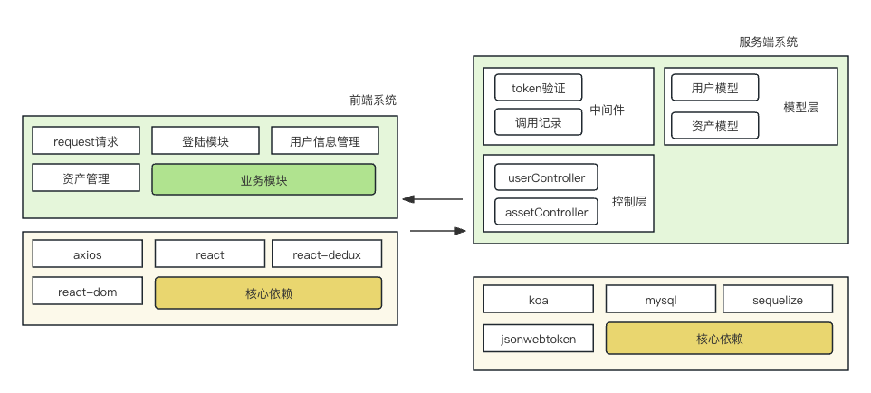

import { Meta } from "@storybook/addon-docs";
import mvcPng from "../assets/node-mvc.png";
import mvcFlowPng from "../assets/mvc-flow.png";

<Meta title="Hundun/常见算法与数据结构/发布订阅&观察者模式" />

# 发布订阅模式 vs 观察者模式

## 一、核心区别

|  | 发布订阅模式（Publish/Subscribe） | 观察者模式（Observer） |
|---|---|---|
| 依赖关系 | 发布者与订阅者之间无直接依赖，通过第三方调度中心（事件总线）解耦 | 观察者与被观察者直接关联，被观察者维护观察者列表 |
| 通信方式 | 通过事件中心/消息中间件 | 直接回调通知 |
| 场景 | 复杂系统、跨模块、异步解耦 | 简单对象间、同步通知 |
| 典型实现 | EventBus、消息队列（MQ） | DOM事件、数据绑定 |

- **发布订阅模式**：发布者和订阅者都不知道对方的存在，事件中心负责消息分发。
- **观察者模式**：被观察者直接持有观察者引用，状态变更时主动通知。

## 二、原理图



## 三、代码实现与例子

### 1. 观察者模式（Observer Pattern）

```javascript
// 被观察者（Subject）
class Subject {
  constructor() {
    this.observers = [];
  }
  addObserver(observer) {
    this.observers.push(observer);
  }
  removeObserver(observer) {
    this.observers = this.observers.filter(obs => obs !== observer);
  }
  notify(data) {
    this.observers.forEach(observer => observer.update(data));
  }
}
// 观察者（Observer）
class Observer {
  constructor(name) {
    this.name = name;
  }
  update(data) {
    console.log(`${this.name} received:`, data);
  }
}
// 用法
const subject = new Subject();
const obs1 = new Observer('A');
const obs2 = new Observer('B');
subject.addObserver(obs1);
subject.addObserver(obs2);
subject.notify('Hello Observers!');
```

### 2. 发布订阅模式（Publish/Subscribe Pattern）

```javascript
// 事件总线（EventBus）
class EventBus {
  constructor() {
    this.events = {};
  }
  subscribe(event, handler) {
    if (!this.events[event]) this.events[event] = [];
    this.events[event].push(handler);
  }
  unsubscribe(event, handler) {
    if (!this.events[event]) return;
    this.events[event] = this.events[event].filter(h => h !== handler);
  }
  publish(event, data) {
    if (!this.events[event]) return;
    this.events[event].forEach(handler => handler(data));
  }
}
// 用法
const bus = new EventBus();
function handler1(data) { console.log('handler1:', data); }
function handler2(data) { console.log('handler2:', data); }
bus.subscribe('test', handler1);
bus.subscribe('test', handler2);
bus.publish('test', 'Hello EventBus!');
```

## 四、应用场景对比
- **观察者模式**：适合对象间一对多、同步、强关联场景，如UI组件、数据绑定。
- **发布订阅模式**：适合模块解耦、异步、跨系统通信，如前端全局事件、微服务消息总线、MQ等。

## 五、总结
- 发布订阅模式更适合复杂、解耦、异步场景。
- 观察者模式适合简单、同步、对象间直接通信。
- 实际开发中，EventBus、消息队列等都是发布订阅模式的工程化实现。
