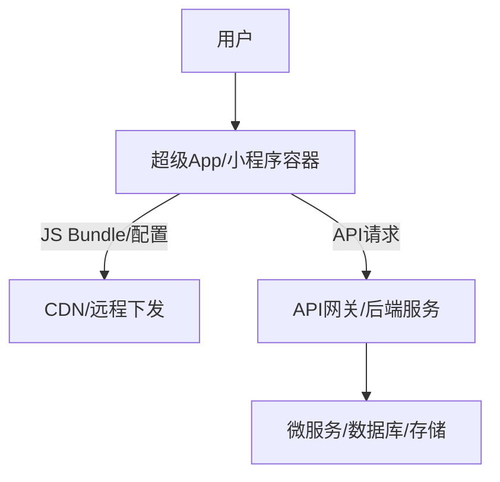
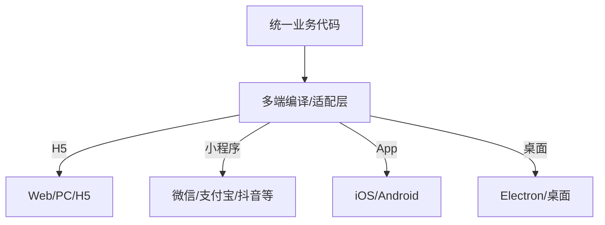

import { Meta } from "@storybook/addon-docs";
import mvcPng from "../assets/node-mvc.png";
import mvcFlowPng from "../assets/mvc-flow.png";

<Meta title="Hundun/现代高可用软件设计/BS或CS架构" />

## 现代高可用B/S与C/S架构的区别

### 1. 架构定义
- **B/S（Browser/Server）架构**：基于浏览器和服务器，用户通过浏览器访问Web应用，前端页面+后端服务，典型如现代Web系统。
- **C/S（Client/Server）架构**：基于专用客户端和服务器，用户需安装客户端程序，客户端与服务器直接通信，典型如传统桌面软件、企业ERP、IM等。

---

### 2. 前后端分工与技术栈
| 架构 | 前端 | 后端 |
|------|------|------|
| B/S  | HTML/CSS/JS/SPA/Vue/React/Angular | Web API/RESTful/GraphQL/Java/Node.js/Python |
| C/S  | 专用客户端（C++/Java/.NET/Qt等） | 专用协议服务/Socket/RPC/数据库 |

- **B/S前后端分离**：前端负责UI与交互，后端提供API，前后端独立开发、部署、扩展。
- **C/S前后端耦合**：客户端与服务端协议紧密绑定，升级需同步，兼容性要求高。

---

### 3. 部署与运维
- **B/S**：服务端统一部署，前端用户无需安装，浏览器即用，易于升级与维护，支持弹性扩容与高可用（如多副本、负载均衡、CDN等）。
- **C/S**：客户端需分发与安装，升级复杂，服务端可集中部署但需兼容多版本客户端，运维成本高。

---

### 4. 优缺点对比
| 维度 | B/S | C/S |
|------|-----|-----|
| 用户体验 | 依赖浏览器，跨平台，响应速度略慢 | 原生体验好，性能高，可深度集成 |
| 部署维护 | 易于统一升级，低运维 | 客户端需分发升级，兼容性难 |
| 扩展性 | 易于横向扩展，云原生友好 | 扩展性一般，升级需全链路配合 |
| 安全性 | 依赖Web安全机制 | 可实现更强本地安全策略 |
| 典型场景 | Web系统、SaaS、移动Web | 金融、IM、桌面软件、工业控制 |

---

### 5. 现代Web前后端分离模式
- 前端：SPA（React/Vue/Angular）、静态资源CDN分发、PWA、移动端H5
- 后端：RESTful API、GraphQL、微服务、Serverless
- 优势：开发效率高、部署灵活、弹性扩展、易于接入多端（Web/小程序/APP）

---

### 6. 总结与选型建议
- 互联网/企业信息化优先B/S，易于维护与扩展
- 对原生性能、深度集成、离线能力要求高的场景可选C/S
- 现代高可用架构推荐B/S+前后端分离+云原生部署，结合CDN、负载均衡、自动化运维，提升可用性与效率

> B/S与C/S架构各有优势，选型需结合业务需求、用户体验与运维能力综合考量。

## 现代C/S架构：小程序、一码多端与动态化

### 1. 现代C/S架构的演进
- 传统C/S：专用客户端+服务端，升级分发难，平台适配复杂
- 现代C/S：以小程序、App壳、H5容器等为代表，支持"一码多端"、动态化、热更新，极大提升了灵活性与可维护性

### 2. 小程序与一码多端
- **小程序**：如微信/支付宝/抖音/百度小程序，运行在超级App容器内，开发者只需一套代码，平台自动适配多端（iOS/Android/桌面/车机等）
- **一码多端**：基于统一技术栈（如Taro、uni-app、Flutter、React Native等），一套代码可编译/运行于Web、App、小程序、快应用等多端，极大提升开发效率与一致性
- **动态化**：支持远程下发页面/业务逻辑，热更新，无需用户手动升级

### 3. 技术实现原理
- 小程序/多端框架将业务代码编译为各平台支持的中间代码（如JS Bundle、WXML、Swan等）
- 容器负责渲染、API适配、权限管理，保障安全与性能
- 动态化通过远程配置、代码分包、热更新等机制实现

### 4. 与传统C/S的区别
| 维度         | 传统C/S                | 现代C/S（小程序/多端）      |
|--------------|------------------------|----------------------------|
| 客户端形态   | 专用App/桌面程序       | 超级App容器/多端适配        |
| 升级方式     | 手动下载安装           | 动态下发/热更新/自动适配    |
| 适配能力     | 单一/多套代码          | 一码多端/统一技术栈         |
| 运维效率     | 低，升级慢             | 高，自动化、弹性            |
| 典型场景     | 金融、ERP、IM          | 电商、O2O、内容、IoT、SaaS  |

### 5. 高可用与最佳实践
- 前端：小程序/多端代码分包、CDN分发、动态下发、灰度发布、A/B测试
- 后端：API网关、微服务、弹性伸缩、服务发现、统一鉴权
- 运维：自动化CI/CD、监控告警、远程配置、热修复
- 安全：容器沙箱、权限隔离、数据加密、风控防刷

### 6. 典型架构图

> 现代C/S架构以小程序和多端技术为代表，兼具原生体验与Web灵活性，适合高频迭代、跨端一致、动态化需求强的业务场景。

## 小程序/多端技术的跨平台方案

### 1. 跨平台目标与挑战
- 一套代码，适配Web（PC/H5）、移动App、各类小程序（微信/支付宝/抖音等）、快应用等多端
- 挑战：平台API差异、UI适配、性能优化、生态兼容、动态化需求

### 2. 主流跨平台技术选型
| 技术方案      | 支持端         | 原理/特点                         |
|--------------|---------------|------------------------------------|
| Taro         | Web/H5/小程序/快应用/React Native | React语法，编译为各端代码，生态丰富 |
| uni-app      | Web/H5/小程序/快应用/App         | Vue语法，编译多端，插件生态好        |
| Flutter      | iOS/Android/Web/桌面             | 跨平台原生渲染，性能优，UI一致      |
| React Native | iOS/Android                     | JS+原生桥接，适合高性能App         |
| Electron     | PC桌面应用                      | Web技术打包桌面，适合工具类         |
| H5+容器      | Web/H5/移动端                    | 纯Web，适配性强，原生能力有限       |

### 3. 技术原理与架构
- 框架将业务代码编译/转换为各端支持的代码（如WXML、Swan、H5、原生组件等）
- 公共业务逻辑/组件复用，平台差异通过适配层/条件编译/平台API封装解决
- 动态化：远程下发页面/配置，支持热更新与灰度发布

### 4. 优缺点对比
| 方案         | 优点                         | 局限                         |
|--------------|------------------------------|------------------------------|
| Taro/uni-app | 生态好，支持多端，开发效率高 | 复杂原生能力需自定义扩展     |
| Flutter      | 性能优，UI一致，体验好       | 小程序/Web兼容性有限         |
| React Native | 性能高，原生扩展强           | 仅限App，生态不如小程序      |
| Electron     | 桌面开发快，Web生态           | 包体大，性能一般             |
| H5           | 适配快，易接入               | 原生能力弱，体验略逊         |

### 5. 典型架构图

### 6. 最佳实践与建议
- 选型优先Taro/uni-app等主流多端框架，提升开发效率与一致性
- 公共组件/业务逻辑最大化复用，平台差异通过适配层/条件编译解决
- 动态化下发、灰度发布、A/B测试，提升灵活性与可维护性
- 结合CI/CD自动化构建与多端发布，保障交付效率
- 关注性能优化与平台兼容性，关键场景可用原生能力补充

> 小程序/多端技术已成为企业级跨平台开发主流方案，建议结合业务需求、团队技术栈与目标平台综合选型。