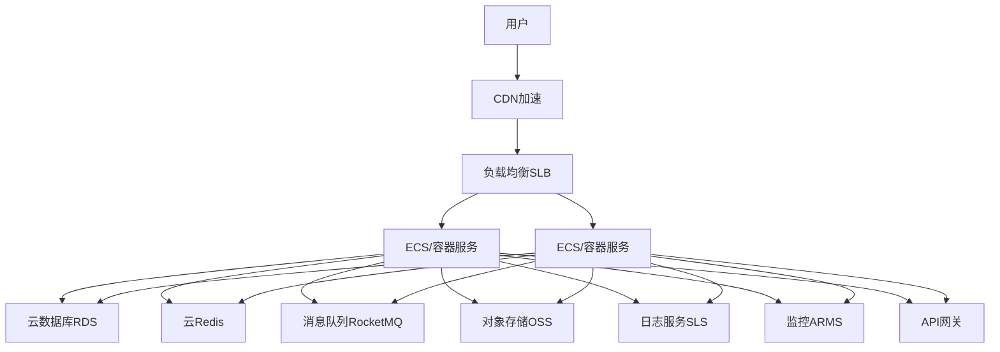

import { Meta } from "@storybook/addon-docs";
import mvcPng from "../assets/node-mvc.png";
import mvcFlowPng from "../assets/mvc-flow.png";

<Meta title="Hundun/现代高可用软件设计/基于阿里云的高可用架构设计"/>

# 基于阿里云的高可用架构设计

## 1. 架构设计目标
- 高可用：消除单点，自动容灾，故障自愈
- 高并发：弹性扩容，流量削峰，异步解耦
- 高性能：全链路优化，缓存加速，负载均衡

---

## 2. 典型高可用架构总览

---

## 3. 核心云产品选型与作用
- **CDN**：静态资源全网加速，防止源站压力
- **SLB（负载均衡）**：L4/L7流量分发，自动健康检查，弹性扩容，消除单点
- **ECS/ACK（云服务器/容器服务K8s）**：弹性计算，支持多语言（Java/Node.js等），支持自动伸缩（ESS）
- **RDS/PolarDB**：高可用数据库，主从/多可用区，读写分离，自动备份
- **Redis/数据库缓存**：高性能缓存，主从/集群，自动故障切换
- **消息队列（RocketMQ/MQ）**：异步解耦，削峰填谷，事务消息
- **OSS**：对象存储，静态资源、备份、归档
- **SLS（日志服务）/ARMS（监控）**：全链路监控、日志采集、告警、APM
- **API网关**：统一入口，流量管理、鉴权、限流、监控
- **WAF/安全组/堡垒机**：安全防护，DDoS防护，访问控制

---

## 4. 弹性与容灾设计
- 多可用区部署，SLB自动分发，ECS/ACK多实例，RDS主备，Redis集群，MQ多副本
- 自动弹性伸缩（ESS），按需扩容/缩容
- 健康检查与自动剔除故障节点
- 数据多副本、自动备份、异地容灾
- 灰度发布、蓝绿部署，降低变更风险

---

## 5. 监控、日志与安全
- ARMS/APM：应用性能监控，调用链追踪，异常告警
- SLS：日志采集、检索、实时告警
- 云监控：资源、流量、数据库、缓存等全栈监控
- WAF/安全组：防护DDoS、SQL注入、XSS等攻击
- 堡垒机：运维安全审计

---

## 6. 前后端高可用方案
- **前端**：OSS+CDN多云多CDN分发，DNS智能切换，静态资源多版本回滚，ARMS前端监控，自动告警与切流
- **后端**：多副本部署，SLB负载均衡，微服务拆分，API网关统一入口，消息队列削峰解耦，数据库/缓存/存储高可用

---

## 7. 最佳实践与建议
- 充分利用阿里云托管服务，减少自运维压力
- 关键服务多可用区、主备、集群部署，消除单点
- 业务无状态化，支持弹性扩容与自动恢复
- 结合消息队列、缓存、CDN等提升并发与性能
- 全链路监控、日志、告警，快速定位与恢复故障
- 定期演练容灾、备份恢复、流量切换，提升韧性

> 基于阿里云的高可用架构，建议优先用云原生托管服务，结合多副本、弹性、监控与安全，打造高并发、高可用、高性能的现代系统。

