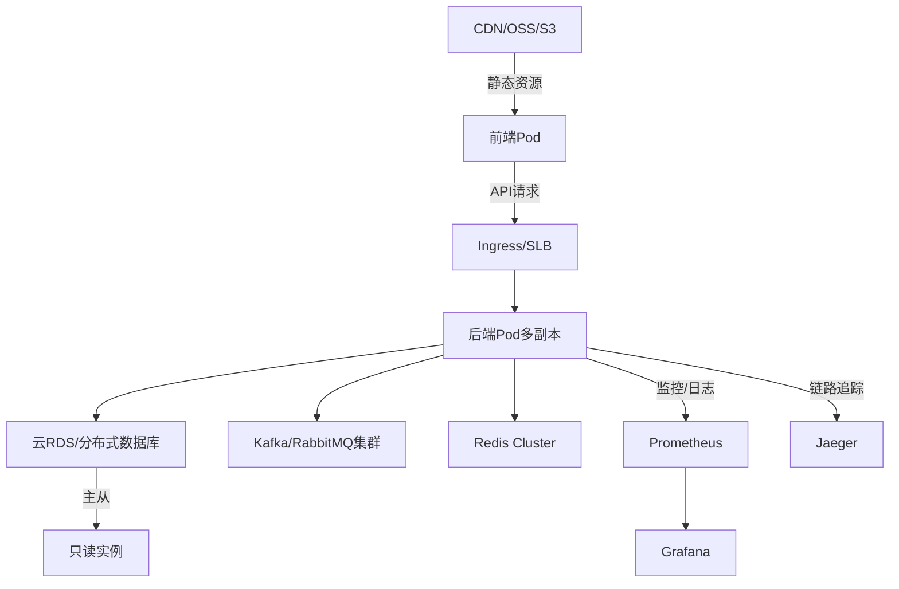

import { Meta } from "@storybook/addon-docs";
import mvcPng from "../assets/node-mvc.png";
import mvcFlowPng from "../assets/mvc-flow.png";

<Meta title="Hundun/现代高可用软件设计/高可用架构设计" />

# 现代高可用架构设计

https://developer.aliyun.com/article/1529204

https://blog.csdn.net/icansoicrazy/article/details/133977354

https://zhuanlan.zhihu.com/p/613497280

https://cloud.tencent.com/developer/article/2383075

## 业界服务架构演进全景

### 1. 单体架构与IDC时代
- **特征**：物理机部署，单体应用，集中式数据库，手工运维，扩容靠加机器
- **优缺点**：开发简单，部署慢，扩展性差，单点故障，资源利用率低
- **典型场景**：早期互联网、电商、企业内部系统

---

### 2. 虚拟化与云计算（IaaS）
- **特征**：物理机虚拟化为VM，弹性分配资源，自动化运维，云主机（ECS）、对象存储（OSS）等
- **优缺点**：资源利用率提升，弹性扩容，自动化部署，仍需手动运维，应用多为单体
- **代表方案**：VMware、OpenStack、阿里云ECS、AWS EC2

---

### 3. 微服务架构
- **特征**：应用拆分为多个小服务，独立部署、扩展、运维，服务间通过API/RPC通信
- **优缺点**：开发效率高，技术栈多样，易于扩展与容错，分布式复杂性提升，运维难度大
- **代表方案**：Spring Cloud、Dubbo、gRPC、Kubernetes微服务编排
- **典型场景**：大型互联网、金融、SaaS平台

---

### 4. 容器化与云原生
- **特征**：应用打包为容器（Docker），Kubernetes编排，声明式基础设施，自动弹性伸缩、服务发现、灰度发布
- **优缺点**：极致弹性、自动化、跨云迁移，DevOps友好，学习曲线高，生态复杂
- **代表方案**：Docker、Kubernetes、Istio、Helm、Prometheus
- **典型场景**：新一代互联网、云厂商PaaS、AI/大数据平台

---

### 5. Serverless（无服务器架构）
- **特征**：开发者只需关注业务代码，按需弹性伸缩，自动运维，事件驱动，极致弹性
- **优缺点**：无需关心底层资源，极致弹性与成本优化，冷启动、状态管理、调试复杂
- **代表方案**：AWS Lambda、阿里云函数计算、腾讯云SCF、Knative、OpenFaaS
- **典型场景**：API网关、定时任务、IoT、AI推理、弹性Web服务

---

### 6. 总结与趋势
- 架构演进驱动力：业务复杂度、弹性需求、运维自动化、成本优化
- 云原生与Serverless是未来主流，微服务与容器化为基础设施，AI与边缘计算持续推动新范式

> 服务架构的每一次演进，都是为了解决更高的弹性、效率与自动化需求。建议结合业务规模、团队能力与云平台生态，选择最适合的架构模式。

## 基于云原生的高可用架构设计方案

### 1. 架构设计原则
- 无状态优先，易于横向扩展
- 自动化部署与弹性伸缩
- 容错与自愈，单点最小化
- 监控、告警、自动修复
- 基础设施即代码（IaC）

---

### 2. 关键技术选型
- **容器化**：Docker，所有服务（前后端、网关、任务等）容器化
- **编排与调度**：Kubernetes（K8s），自动部署、弹性伸缩、服务发现、滚动升级
- **服务网格**：Istio/Linkerd，流量治理、熔断、灰度发布、可观测性
- **CI/CD**：Jenkins/GitHub Actions/ArgoCD，自动化构建、测试、部署
- **配置中心**：K8s ConfigMap/Secret、Apollo/Nacos
- **监控与日志**：Prometheus+Grafana、ELK/EFK、Jaeger/Zipkin
- **云平台能力**：阿里云ACK、腾讯云TKE、AWS EKS等

---

### 3. 前端高可用方案
- **静态资源托管**：OSS/S3+CDN，前端构建产物自动上传，全球加速
- **多活部署**：多区域CDN、DNS智能解析，自动切流
- **前端容器化**：SSR/Node渲染服务容器化，K8s弹性伸缩
- **健康检查与回源**：CDN健康检查，自动回源，防止单点

---

### 4. 后端高可用方案
- **多副本部署**：K8s Deployment副本数>2，Pod自动分布多节点
- **服务发现与负载均衡**：K8s Service+Ingress，自动流量分发，结合云SLB
- **数据库高可用**：云RDS主从/多可用区，读写分离，自动故障切换
- **缓存高可用**：Redis Cluster/Sentinel，自动主备切换
- **消息队列高可用**：Kafka/RabbitMQ集群，分区与副本
- **配置热更新**：配置中心+K8s热加载
- **自动弹性伸缩**：HPA/VPA，按流量自动扩缩容
- **无状态服务**：Session存Redis/Token，Pod随时可重建

---

### 5. 基础设施与运维
- **IaC**：Terraform/CloudFormation，自动化资源编排
- **自动化运维**：K8s Operator、ArgoCD、自动修复脚本
- **全链路监控**：Prometheus监控K8s、服务、数据库，Grafana可视化，Alertmanager告警
- **日志采集**：EFK/ELK，日志统一采集、检索、告警
- **链路追踪**：Jaeger/Zipkin，服务间调用追踪
- **混沌工程**：Chaos Mesh/Gremlin，主动注入故障验证高可用性

---

### 6. 典型云原生高可用架构图


---

### 7. 最佳实践与建议
- 前后端、数据库、缓存、MQ等全链路多副本、分区、主备，消除单点
- 自动化CI/CD与IaC，提升交付效率与一致性
- 健康检查、自动弹性、故障自愈，提升可用性
- 监控、日志、追踪全覆盖，快速定位与恢复故障
- 结合云平台托管能力与自建K8s，灵活应对不同规模

> 云原生高可用架构需全链路自动化、弹性、可观测，建议优先用云平台托管能力，结合K8s与服务网格，打造弹性、可靠、可扩展的现代系统。

## 前端静态资源容灾方案

### 1. 多云多CDN分发
- 静态资源同步部署到多家云存储（如阿里云OSS、腾讯云COS、AWS S3等）
- 配置多家CDN（阿里云CDN、腾讯云CDN、Cloudflare、Akamai等）分发同一资源，提升全球可用性
- 资源URL支持多CDN前缀，前端可动态切换

### 2. DNS智能解析与健康检查
- 使用DNS服务（如阿里云云解析、DNSPod、Cloudflare DNS）配置多条CNAME，指向不同CDN
- 启用健康检查，自动剔除故障CDN节点，实现秒级切换
- 支持权重分配，主备或多活流量分担

### 3. 自动回源与多级缓存
- CDN配置回源到多云存储，主源故障自动回源到备源
- CDN多级缓存，边缘节点失效自动回源上一级，提升容灾能力

### 4. 版本管理与回滚
- 静态资源采用内容哈希命名，支持多版本共存
- 发现CDN/存储异常时，快速切换到历史稳定版本

### 5. 监控与自动告警
- 配置CDN、云存储、DNS的可用性监控（如Ping、HTTP探测、CDN命中率等）
- 异常自动告警，触发切流或回滚脚本
- 结合APM/前端埋点，监控用户静态资源加载成功率

### 6. 企业级最佳实践
- 多云多CDN+DNS智能切换，消除单点
- 自动化同步与发布脚本，保障多云一致性
- 监控、告警、切流、回滚全链路自动化
- 定期演练容灾切换，确保方案有效

> 前端静态资源容灾的核心是多云多CDN、智能切换与自动化监控，建议企业级项目务必全链路演练，保障极端情况下的可用性。

## 前端静态资源容灾实战：脚本、配置与云平台操作指引

### 1. 自动化多云同步脚本（OSS+S3为例）
```bash
# 假设已配置好OSSUtil和AWS CLI
# 构建产物目录为 ./dist
# 上传到阿里云OSS
ossutil cp -r ./dist oss://your-oss-bucket/ --update
# 上传到AWS S3
aws s3 sync ./dist s3://your-s3-bucket/ --delete
```

### 2. CDN多源配置示例（以阿里云CDN为例）
- 登录阿里云CDN控制台，添加域名，源站类型选择"对象存储"，可配置主源（OSS）和备源（S3/COS等）
- 配置回源策略：主源不可用时自动回源到备源
- 支持多级缓存、回源Host自定义

### 3. DNS智能切换配置（以阿里云云解析为例）
- 添加CNAME记录，分别指向不同CDN加速域名
- 配置健康检查（HTTP/HTTPS探测），异常自动切换到可用CDN
- 可设置权重，实现主备或多活流量分担

### 4. 版本回滚与多CDN前缀切换（前端代码示例）
```js
// 支持多CDN前缀，自动切换
const cdnList = [
  'https://cdn1.example.com/',
  'https://cdn2.example.com/',
  'https://cdn3.example.com/'
];
function loadStaticResource(path) {
  for (let cdn of cdnList) {
    const url = cdn + path;
    // 可用fetch/ping等方式检测可用性
    // 如检测到可用即返回
  }
}
```

### 5. 监控与自动告警（以阿里云为例）
- CDN控制台开启"可用性监控"，配置告警规则（如命中率、回源失败、带宽异常等）
- OSS/S3开启对象存储访问监控，异常自动告警
- 可结合云监控（CloudMonitor）、钉钉/企业微信/短信等多渠道通知

### 6. 企业级自动化发布与切流脚本（伪代码）
```bash
# 自动同步、检测、切流
ossutil cp -r ./dist oss://your-oss-bucket/ --update
aws s3 sync ./dist s3://your-s3-bucket/ --delete
# 检查CDN健康，异常时自动修改DNS权重或CNAME指向
# 可用阿里云OpenAPI/SDK自动化操作
```

### 7. 阿里云全链路操作指引
1. OSS创建静态资源Bucket，配置跨域、读权限
2. CDN添加加速域名，源站选OSS，配置主备源、回源策略
3. 云解析DNS添加CNAME，配置健康检查与权重
4. 配置CDN/OSS监控与自动告警
5. 前端构建产物自动上传OSS（可用CI/CD流水线集成）
6. 定期演练切流与回滚，确保容灾方案有效

> 结合自动化脚本、云平台配置与监控告警，可实现企业级前端静态资源多云多CDN容灾，极大提升可用性与韧性。

## OSS与CDN的区别与协同

### 1. 定义与作用
- **OSS（对象存储）**：Object Storage Service，云端海量文件存储服务，适合存储图片、音视频、静态资源、备份等，支持高可用、持久化、权限管理。
- **CDN（内容分发网络）**：Content Delivery Network，将内容缓存到全球各地的边缘节点，用户就近访问，提升访问速度和并发能力，降低源站压力。

### 2. 核心区别
| 维度         | OSS（对象存储）         | CDN（内容分发网络）         |
|--------------|------------------------|----------------------------|
| 主要功能     | 存储与管理文件         | 分发与加速内容              |
| 访问入口     | 云存储服务域名/接口    | 边缘节点分发域名            |
| 访问速度     | 取决于存储地与用户距离 | 用户就近节点，极快          |
| 计费方式     | 存储容量+流量          | 带宽/流量+请求数            |
| 持久化       | 高持久化               | 非持久化，缓存失效后回源    |
| 权限控制     | 精细化（Bucket、对象） | 一般无，依赖源站            |
| 典型场景     | 静态资源、备份、归档   | 网站加速、下载分发、直播等  |

### 3. 协同用法
- 典型模式：静态资源先上传到OSS，CDN以OSS为源站进行全网加速，用户优先从CDN边缘节点获取，未命中时回源OSS。
- 优势：兼具高可用存储与极速分发，降低源站压力，提升用户体验。

### 4. 场景举例
- 图片/视频/前端静态资源：OSS存储，CDN加速分发
- 大文件下载：OSS存储，CDN分发，断点续传
- 直播/点播：CDN边缘节点实时分发，源站为OSS或流媒体服务器

> 总结：OSS负责"存"，CDN负责"快"，两者结合是现代互联网内容分发的最佳实践。
