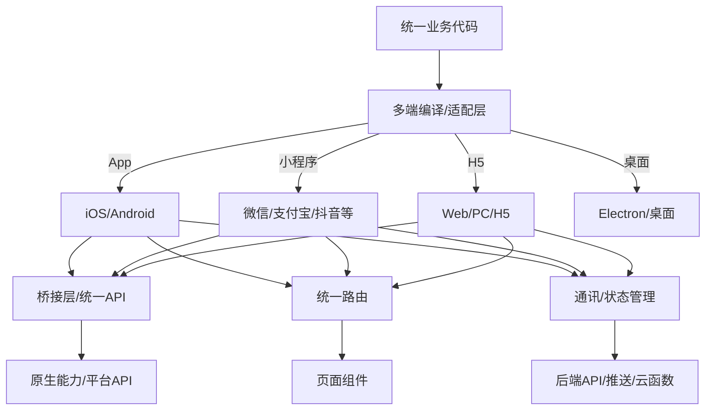
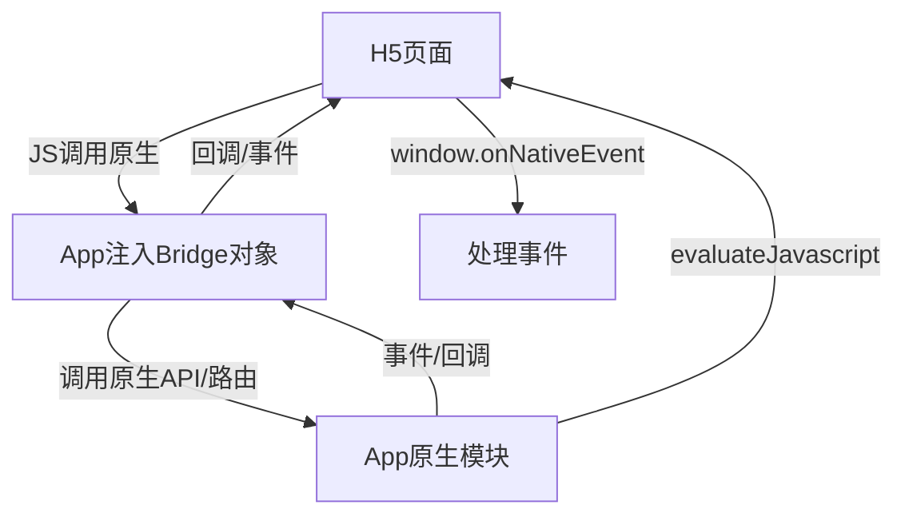
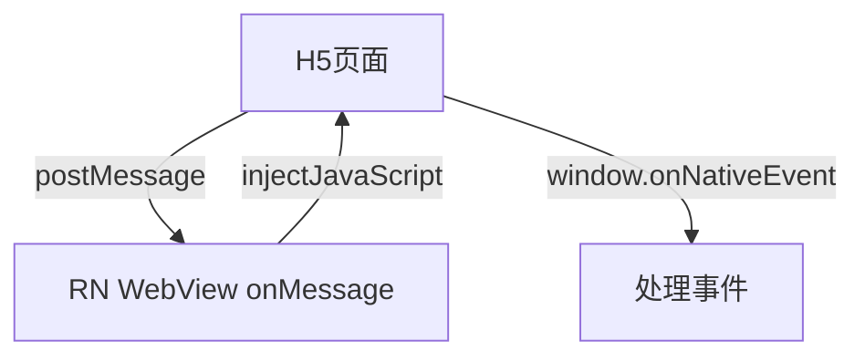
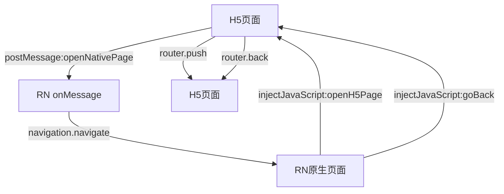

import { Meta } from "@storybook/addon-docs";
import mvcPng from "../assets/node-mvc.png";
import mvcFlowPng from "../assets/mvc-flow.png";

<Meta title="Hundun/现代高可用软件设计/C端一码多端架构设计"/>

# C端一码多端架构设计

## 1. 一码多端架构设计目标
- 一套代码，适配多端（Web/H5、iOS、Android、各类小程序、快应用、桌面等）
- 降低开发/维护成本，提升一致性与交付效率
- 支持动态化、热更新、A/B测试、灰度发布

---

## 2. 业界主流方案对比

| 方案         | 支持端         | 技术栈/原理         | 生态/代表厂商         |
|--------------|---------------|---------------------|----------------------|
| React Native | iOS/Android   | JS+原生桥，原生渲染 | Facebook、字节跳动   |
| uni-app      | Web/H5/小程序/快应用/App | Vue语法，编译多端 | DCloud、阿里、腾讯   |
| Taro         | Web/H5/小程序/快应用/App | React语法，编译多端 | 京东、携程、字节跳动 |
| Flutter      | iOS/Android/Web/桌面     | Dart，原生渲染      | Google、阿里         |
| 阿里方案     | Rax+MiniApp   | Rax+多端适配器      | 阿里巴巴              |
| 腾讯方案     | TMagicEditor、TDesign、uni-app | 多端适配/组件库 | 腾讯                 |

- **uni-app**：Vue语法，支持H5、App、小程序、快应用，生态丰富，插件多，DCloud/阿里/腾讯均有大规模实践
- **Taro**：React语法，支持H5、App、小程序，灵活度高，适合React团队，京东/携程/字节跳动等大厂使用
- **RN/Flutter**：适合高性能原生体验场景，部分支持Web/H5，动态化能力强
- **阿里Rax/MiniApp**：Rax为React风格，MiniApp多端适配，阿里系小程序/IoT/车载等广泛应用
- **腾讯TMagic/uni-app**：TMagicEditor、TDesign等多端组件库，uni-app深度集成

---

## 3. 桥接层（Bridge）设计
- **作用**：实现JS与原生/小程序/宿主环境的双向通信，屏蔽平台差异，统一API调用
- **实现方式**：
  - RN/Flutter：JS/JSCore与原生通过Bridge通信，支持异步、事件、回调
  - uni-app/Taro：框架自动注入平台API，开发者通过统一API调用，底层适配各端
  - 小程序/快应用：通过JSBridge/NativeBridge实现WebView与原生通信
- **最佳实践**：
  - 统一API接口，平台差异通过适配层/条件编译处理
  - 支持Promise/Callback，兼容异步/同步调用
  - 支持事件订阅/发布，便于消息推送、状态同步

---

## 4. 路由设计
- **需求**：多端一致的路由声明、跳转、参数传递、历史管理
- **主流方案**：
  - uni-app：内置uni.navigateTo/redirectTo等API，支持页面栈管理
  - Taro：taro-router，支持多端路由声明与跳转
  - RN/Flutter：react-navigation、Navigator等，原生路由栈
  - 阿里Rax：rax-app/router，支持多端路由
- **最佳实践**：
  - 路由声明式配置，支持嵌套路由、动态参数
  - 路由守卫/中间件，支持鉴权、埋点、A/B测试
  - 路由与页面解耦，便于动态化与热更新

---

## 5. H5结合与多端渲染
- **WebView嵌套**：App/小程序内嵌H5页面，桥接层实现JS与原生通信
- **多端渲染**：同一业务组件可渲染为H5、原生、Canvas等，提升复用率
- **动态化**：远程下发H5/JS Bundle，支持热更新、灰度发布
- **最佳实践**：
  - 业务核心用多端框架开发，特殊场景用H5补充
  - 桥接层支持H5与原生/小程序互调，提升体验
  - 统一埋点、监控、鉴权，保障多端一致性

---

## 6. 通讯机制
- **前后端通讯**：统一API接口（RESTful/GraphQL），多端共用一套后端服务
- **端内通讯**：事件总线（EventBus）、全局状态管理（Vuex/Redux/MobX）、消息订阅发布
- **端间通讯**：WebSocket、MQTT、推送服务，支持实时消息、状态同步
- **最佳实践**：
  - API接口规范化，支持多端鉴权、限流、灰度
  - 端内用事件/状态管理，端间用WebSocket/推送
  - 结合云函数/Serverless，提升弹性与扩展性

---

## 7. 典型架构图


---

## 8. 最佳实践与建议
- 选型优先Taro/uni-app等主流多端框架，提升开发效率与一致性
- 桥接层/适配层统一API，平台差异用条件编译/适配器处理
- 路由声明式、支持守卫与动态化，便于灰度与A/B
- H5与原生/小程序互通，提升体验与灵活性
- 通讯机制规范化，前后端接口统一，端内/端间消息高效同步
- 结合CI/CD自动化构建与多端发布，保障交付效率
- 关注性能优化与平台兼容性，关键场景可用原生能力补充

> 一码多端是现代C端高可用架构的主流趋势，建议结合业务需求、团队技术栈与目标平台综合选型，充分利用桥接层、路由、通讯等技术实现多端一致、高效、可扩展的产品体验。

## 9. 主流方案落地代码与实践

### 9.1 React Native（RN）
#### 组件代码示例
```jsx
import React from 'react';
import { View, Text, Button } from 'react-native';
export default function Home({ navigation }) {
  return (
    <View>
      <Text>Hello RN!</Text>
      <Button title="Go Detail" onPress={() => navigation.navigate('Detail')} />
    </View>
  );
}
```
#### 桥接层实现（原生与JS通信）
- JS调用原生：
```js
import { NativeModules } from 'react-native';
NativeModules.MyNativeModule.showToast('Hello from JS!');
```
- 原生调用JS：通过事件分发（DeviceEventEmitter）
#### 路由实现
- 使用`react-navigation`，支持多端路由栈、参数传递、守卫
#### 通讯实现
- 前后端：fetch/axios请求RESTful API
- 端内：Redux/MobX全局状态
- 端间：WebSocket/推送服务
#### 企业级案例
- 字节跳动、Facebook、滴滴等大规模RN实践，支持动态化、热更新（CodePush）
#### CI/CD实践
- Fastlane+Jenkins/GitHub Actions自动打包、测试、发布

---

### 9.2 uni-app
#### 组件代码示例
```vue
<template>
  <view>
    <text>{{ msg }}</text>
    <button @click="goDetail">跳转</button>
  </view>
</template>
<script>
export default {
  data() { return { msg: 'Hello uni-app!' } },
  methods: {
    goDetail() { uni.navigateTo({ url: '/pages/detail/detail' }) }
  }
}
</script>
```
#### 桥接层实现
- 统一API（如`uni.getLocation()`），底层自动适配各端
#### 路由实现
- `uni.navigateTo`、`uni.redirectTo`，页面栈管理
#### 通讯实现
- 前后端：`uni.request`/axios
- 端内：Vuex
- 端间：WebSocket/uniCloud云函数
#### 企业级案例
- 支付宝/微信/百度/抖音小程序、阿里/腾讯/京东等均有大规模uni-app项目
#### CI/CD实践
- DCloud云打包、Jenkins/GitHub Actions自动化多端构建与发布

---

### 9.3 Taro
#### 组件代码示例
```jsx
import Taro from '@tarojs/taro';
import { View, Button } from '@tarojs/components';
export default function Home() {
  const goDetail = () => Taro.navigateTo({ url: '/pages/detail/index' });
  return (
    <View>
      Hello Taro!
      <Button onClick={goDetail}>跳转</Button>
    </View>
  );
}
```
#### 桥接层实现
- Taro API自动适配多端（如`Taro.getLocation()`）
#### 路由实现
- `Taro.navigateTo`、`Taro.redirectTo`，支持多端路由
#### 通讯实现
- 前后端：Taro.request/axios
- 端内：Redux/MobX
- 端间：WebSocket/云开发
#### 企业级案例
- 京东、携程、字节跳动等大厂多端项目
#### CI/CD实践
- Taro CLI+Jenkins/GitHub Actions自动化多端构建与发布

---

### 9.4 Flutter
#### 组件代码示例
```dart
import 'package:flutter/material.dart';
class Home extends StatelessWidget {
  @override
  Widget build(BuildContext context) {
    return Scaffold(
      body: Center(child: Text('Hello Flutter!')),
      floatingActionButton: FloatingActionButton(
        onPressed: () => Navigator.pushNamed(context, '/detail'),
        child: Icon(Icons.arrow_forward),
      ),
    );
  }
}
```
#### 桥接层实现
- MethodChannel实现Dart与原生通信
```dart
static const platform = MethodChannel('com.example/native');
Future<void> showToast() async {
  await platform.invokeMethod('showToast', {'msg': 'Hello from Dart!'});
}
```
#### 路由实现
- Navigator/GoRouter，支持多端路由
#### 通讯实现
- 前后端：http/dio
- 端内：Provider/Bloc
- 端间：WebSocket/Firebase推送
#### 企业级案例
- Google、阿里、腾讯、百度等多端App
#### CI/CD实践
- Flutter CLI+Codemagic/GitHub Actions自动化打包与发布

---

### 9.5 阿里Rax/MiniApp
#### 组件代码示例
```jsx
import { createElement, useState } from 'rax';
import View from 'rax-view';
import Text from 'rax-text';
export default function Home() {
  const [msg] = useState('Hello Rax!');
  return <View><Text>{msg}</Text></View>;
}
```
#### 桥接层实现
- Rax API自动适配多端，MiniApp适配器对接阿里小程序/IoT/车载
#### 路由实现
- rax-app/router，声明式路由
#### 通讯实现
- fetch/axios，云函数/Serverless
#### 企业级案例
- 阿里巴巴、钉钉、天猫精灵等多端项目
#### CI/CD实践
- Rax CLI+阿里云流水线/自研平台自动化构建与发布

---

### 9.6 腾讯TMagic/uni-app
#### 组件代码示例
```vue
<template>
  <view><text>{{ msg }}</text></view>
</template>
<script>
export default { data() { return { msg: 'Hello TMagic!' } } }
</script>
```
#### 桥接层实现
- TMagicEditor/uni-app统一API，底层适配多端
#### 路由实现
- uni-app路由，TMagic支持多端页面跳转
#### 通讯实现
- 腾讯云API、WebSocket、云开发
#### 企业级案例
- 腾讯云、企业微信、QQ小程序等多端项目
#### CI/CD实践
- 腾讯云开发平台、Jenkins/GitHub Actions自动化多端发布

---

## 10. 通用CI/CD自动化实践
- 代码托管：GitHub/GitLab/企业自研平台
- 自动化构建：Jenkins/GitHub Actions/Coding/阿里云流水线/腾讯云流水线
- 多端打包：框架CLI+云打包服务
- 自动化测试：Jest/Mocha/Flutter Test等
- 自动化发布：各端应用市场/小程序后台/云端一键发布
- 版本管理与回滚：自动生成版本号，支持灰度、A/B测试、回滚

> 以上为主流一码多端方案的典型落地代码、桥接层/路由/通讯实现、企业级案例与CI/CD自动化实践，建议结合团队技术栈与业务需求选型落地。

## 11. App与H5桥（Bridge）实现与设计详解

### 11.1 Bridge的作用与设计目标
- 实现App原生与H5（WebView）/JS的双向通信，屏蔽平台差异，统一API调用
- 支持异步/同步调用、事件订阅/发布、数据回传、权限校验、调试与扩展

---

### 11.2 React Native（RN）桥实现
#### 原理
- RN内置JSCore引擎，JS与原生通过Bridge通信（C++/Java/ObjC层），支持异步消息队列
#### 加载方式
- App启动时自动加载Bridge，JS Bundle与原生模块注册
#### 典型实现
- JS调用原生：
```js
import { NativeModules } from 'react-native';
NativeModules.MyNativeModule.showToast('Hello from JS!');
```
- 原生注册模块（Android示例）：
```java
public class MyNativeModule extends ReactContextBaseJavaModule {
  @ReactMethod
  public void showToast(String msg) {
    Toast.makeText(getReactApplicationContext(), msg, Toast.LENGTH_SHORT).show();
  }
}
```
- 原生调用JS：通过事件分发（DeviceEventEmitter）
#### 设计建议
- 统一API接口，参数/回调序列化，支持Promise
- 权限校验、异常处理、日志埋点
- 支持动态注册/扩展新能力

---

### 11.3 uni-app/Taro桥实现
#### 原理
- 框架自动注入平台API，H5端通过JSBridge与原生通信，App端WebView注入JS对象
#### 加载方式
- App启动时WebView注入JSBridge对象，H5页面可直接调用
#### 典型实现
- H5调用原生：
```js
// uni-app H5端
uni.getLocation({
  success: res => { /* ... */ }
});
// 实际底层通过JSBridge转发到原生
```
- 原生注入JS对象（Android示例）：
```java
webView.addJavascriptInterface(new JsBridge(), "uni" /* JS对象名 */);
```
- 原生调用H5：
```java
webView.evaluateJavascript("window.onNativeMessage('data')", null);
```
#### 设计建议
- 统一API命名，参数校验，支持回调/Promise
- 支持事件订阅/发布，便于消息推送
- 兼容多端（App/H5/小程序）差异

---

### 11.4 Flutter桥实现
#### 原理
- Dart与原生通过MethodChannel通信，支持双向异步消息
#### 加载方式
- App启动时注册MethodChannel，H5通过WebView与原生通信
#### 典型实现
- Dart调用原生：
```dart
static const platform = MethodChannel('com.example/native');
Future<void> showToast() async {
  await platform.invokeMethod('showToast', {'msg': 'Hello from Dart!'});
}
```
- 原生注册通道（Android示例）：
```java
new MethodChannel(flutterView, "com.example/native").setMethodCallHandler(
  (call, result) -> { /* ... */ }
);
```
- Flutter内嵌H5：通过flutter_webview_plugin等插件，WebView与原生通信
#### 设计建议
- 统一通道命名，参数序列化，支持异步回调
- 支持事件流（EventChannel）
- 权限与安全校验

---

### 11.5 阿里Rax/MiniApp桥实现
#### 原理
- Rax多端适配器自动注入Bridge，H5端通过window.JSBridge与原生通信
#### 加载方式
- App/小程序容器启动时注入JSBridge对象，H5页面可直接调用
#### 典型实现
- H5调用原生：
```js
window.JSBridge.invoke('getLocation', {}, res => { /* ... */ });
```
- 原生注入JSBridge（伪代码）：
```js
webView.addJavascriptInterface(new JSBridge(), "JSBridge");
```
- 原生调用H5：
```js
webView.evaluateJavascript("window.onNativeEvent('data')", null);
```
#### 设计建议
- 统一API、事件命名，支持Promise/回调
- 支持多端适配与扩展
- 日志、埋点、权限校验

---

### 11.6 腾讯TMagic/uni-app桥实现
#### 原理
- TMagic/uni-app底层自动注入Bridge，H5端通过window.TMagicBridge/uni对象与原生通信
#### 加载方式
- App/小程序容器启动时注入Bridge对象，H5页面可直接调用
#### 典型实现
- H5调用原生：
```js
window.TMagicBridge.invoke('getUserInfo', {}, res => { /* ... */ });
```
- 原生注入Bridge（Android示例）：
```java
webView.addJavascriptInterface(new TMagicBridge(), "TMagicBridge");
```
- 原生调用H5：
```java
webView.evaluateJavascript("window.onNativeEvent('data')", null);
```
#### 设计建议
- 统一API、事件命名，支持异步/同步、回调/Promise
- 支持多端扩展、权限校验、埋点

---

### 11.7 通用桥（Bridge）设计要点
- **API统一**：所有端暴露一致的API接口，参数/回调序列化，支持Promise/Callback
- **事件机制**：支持事件订阅/发布，便于消息推送、状态同步
- **安全与权限**：参数校验、权限控制、防止XSS/注入
- **动态扩展**：支持动态注册新API，便于灰度/热更新
- **调试与埋点**：日志、异常、性能监控全链路可观测
- **多端兼容**：适配App/H5/小程序/快应用等多端差异

> 桥（Bridge）是多端架构的核心基础设施，建议结合业务需求、平台能力与安全要求，设计统一、可扩展、可观测的桥接层，提升多端一致性与开发效率。

## 12. H5（WebView）与App通信与路由适配详解

### 12.1 H5与App通信的本质
- H5页面通常运行在App的WebView容器中，WebView提供了原生与JS互通的能力。
- 通信分为两类：
  - H5调用App（JS调用原生）
  - App调用H5（原生调用JS）

---

### 12.2 H5调用App（JS调用原生）
#### 1）Android实现
- 原生通过`addJavascriptInterface`注入对象到WebView，H5可直接调用：
```java
// 原生代码
webView.addJavascriptInterface(new MyBridge(), "AppBridge");

public class MyBridge {
  @JavascriptInterface
  public void showToast(String msg) { /* ... */ }
}
```
- H5代码：
```js
window.AppBridge.showToast('Hello from H5!');
```
#### 2）iOS实现
- WKWebView通过`WKScriptMessageHandler`注入对象，H5通过`window.webkit.messageHandlers`调用：
```js
window.webkit.messageHandlers.AppBridge.postMessage({ action: 'showToast', msg: 'Hello from H5!' });
```
- 原生实现对应的`userContentController`方法
#### 3）通用方案
- 统一封装Bridge对象，H5端通过`window.Bridge.xxx()`调用，底层自动适配Android/iOS
- 支持Promise/回调、参数校验、异步返回

---

### 12.3 App调用H5（原生调用JS）
#### 1）Android实现
- 原生通过`evaluateJavascript`或`loadUrl`执行H5 JS代码：
```java
webView.evaluateJavascript("window.onNativeEvent('data')", null);
```
#### 2）iOS实现
- WKWebView通过`evaluateJavaScript`方法：
```swift
webView.evaluateJavaScript("window.onNativeEvent('data')")
```
#### 3）H5端监听
```js
window.onNativeEvent = function(data) { /* ... */ }
```
- 支持事件订阅/发布、回调机制

---

### 12.4 路由适配与跳转方案
#### 1）H5内路由
- H5页面通常用前端路由（如vue-router、react-router），通过`pushState`/`hash`管理页面跳转
- H5内跳转可直接用SPA路由API
#### 2）App与H5路由联动
- H5需要跳转App原生页面时：
  - H5通过Bridge调用App的`navigateTo`方法，传递目标页面标识和参数
  - App收到后解析参数，跳转到对应原生页面
  - 典型代码：
    ```js
    window.AppBridge.navigateTo('nativePage', { id: 123 });
    ```
- App需要跳转H5页面时：
  - App通过WebView加载指定URL，或通过Bridge调用H5的路由API
  - 典型代码：
    ```java
    webView.evaluateJavascript("window.routerPush('/detail?id=123')", null);
    ```
    ```js
    window.routerPush = function(path) { router.push(path); }
    ```
#### 3）参数与回调
- 路由跳转时参数通过JSON序列化传递，支持回调/Promise获取结果
- 建议统一路由协议，约定页面标识、参数格式、回调机制

---

### 12.5 通信与路由适配最佳实践
- 统一Bridge对象，封装所有通信API，兼容Android/iOS/H5
- 支持事件订阅/发布，便于消息推送、状态同步
- 路由跳转协议化，支持原生与H5互跳、参数回传
- H5与App路由解耦，H5内用SPA路由，App用原生路由，Bridge负责跳转桥接
- 安全校验、异常处理、埋点监控全链路覆盖

---

### 12.6 典型通信流程图


> H5与App通信的核心是WebView注入Bridge对象，双向通过方法调用和事件机制实现互通，路由适配需协议化、解耦，建议统一API与路由协议，提升多端一致性与开发效率。

## 13. React Native（RN）App与H5（WebView）桥的使用详解

### 13.1 通信原理
- RN App内嵌H5页面时，通常通过`react-native-webview`组件加载WebView。
- RN与H5通过WebView的`injectJavaScript`、`onMessage`、`postMessage`等API实现双向通信。

---

### 13.2 H5调用RN App（JS调用原生）
#### 1）H5端代码
- H5页面通过`window.ReactNativeWebView.postMessage()`向RN发送消息：
```js
window.ReactNativeWebView.postMessage(JSON.stringify({ action: 'showToast', msg: 'Hello from H5!' }));
```
#### 2）RN端代码
- RN WebView组件监听`onMessage`事件：
```jsx
import React from 'react';
import { WebView } from 'react-native-webview';
import { ToastAndroid } from 'react-native';

export default function MyWebView() {
  const onMessage = event => {
    const data = JSON.parse(event.nativeEvent.data);
    if (data.action === 'showToast') {
      ToastAndroid.show(data.msg, ToastAndroid.SHORT);
    }
  };
  return (
    <WebView
      source={{ uri: 'https://your-h5-page.com' }}
      onMessage={onMessage}
    />
  );
}
```

---

### 13.3 RN App调用H5（原生调用JS）
#### 1）RN端代码
- 通过WebView的`injectJavaScript`方法执行H5 JS代码：
```jsx
const webviewRef = useRef();
const sendToH5 = () => {
  webviewRef.current.injectJavaScript(`window.onNativeEvent && window.onNativeEvent('data from RN'); true;`);
};
return (
  <WebView ref={webviewRef} ... />
  <Button title="Send to H5" onPress={sendToH5} />
);
```
#### 2）H5端代码
- H5页面监听window方法：
```js
window.onNativeEvent = function(data) {
  // 处理来自RN的数据
  alert('收到RN消息: ' + data);
};
```

---

### 13.4 路由适配与跳转
- H5需要跳转RN原生页面时：H5通过`postMessage`发送跳转指令，RN端解析后调用`navigation.navigate`等API跳转。
- RN需要跳转H5页面时：通过`injectJavaScript`调用H5的路由API（如`window.router.push('/detail')`）。
- 建议统一消息协议，参数用JSON序列化，支持回调。

---

### 13.5 最佳实践
- 统一消息协议，定义action、参数、回调格式
- H5与RN端均需做好异常处理与安全校验
- 支持事件订阅/发布，便于消息推送与状态同步
- 路由跳转协议化，解耦H5与RN路由
- 可扩展为Promise风格，支持异步回调

---

### 13.6 通信流程图


> RN与H5桥的核心是WebView的postMessage/onMessage/injectJavaScript机制，建议统一协议、解耦路由、加强安全，提升多端一致性与开发效率。

## 14. H5调用RN能力、双端路由区分与互跳实践

### 14.1 H5如何调用RN（原生）能力
- H5通过`window.ReactNativeWebView.postMessage()`向RN发送消息，RN端`onMessage`监听并执行原生操作。
- 典型代码：
```js
// H5页面
window.ReactNativeWebView.postMessage(JSON.stringify({
  action: 'openNativePage',
  page: 'UserProfile',
  params: { userId: 123 }
}));
```
- RN端：
```jsx
const onMessage = event => {
  const data = JSON.parse(event.nativeEvent.data);
  if (data.action === 'openNativePage') {
    navigation.navigate(data.page, data.params);
  }
};
```
- 支持回调：H5可传递callbackId，RN操作完成后通过`injectJavaScript`回调H5

---

### 14.2 路由区分与互跳
#### 1）H5内路由
- H5页面内跳转（如SPA）：直接用前端路由（如`router.push('/about')`），不通知RN。
#### 2）RN内路由
- RN原生页面跳转：直接用`navigation.navigate('PageName')`，不通知H5。
#### 3）H5跳转RN页面
- H5通过Bridge（postMessage）发送跳转指令，RN端解析后跳转原生页面。
- 建议action统一为`openNativePage`，参数包含目标页面和参数。
#### 4）RN跳转H5页面
- RN通过`injectJavaScript`调用H5的路由API（如`window.router.push('/detail')`），或直接WebView加载新URL。
- 建议action统一为`openH5Page`，参数包含目标路径。

---

### 14.3 返回路径与历史管理
- H5与RN需各自维护自己的路由栈。
- 互跳时建议：
  - 跳转前记录来源（from），如H5跳转RN时，H5记录当前路径，RN记录来源为H5。
  - 返回时优先回到来源页面，若无则按各自历史栈返回。
- 典型协议：
```js
// H5跳转RN
window.ReactNativeWebView.postMessage(JSON.stringify({
  action: 'openNativePage',
  page: 'UserProfile',
  params: { userId: 123 },
  from: window.location.pathname
}));
// RN返回H5
webviewRef.current.injectJavaScript(`window.router.push('${from || '/'}')`);
```
- 支持回调/Promise，确保跳转和返回链路可控。

---

### 14.4 路由与跳转协议设计建议
- 统一action命名（如openNativePage/openH5Page/goBack）
- 参数结构化（page/path/params/from/callbackId等）
- 跳转前记录来源，返回时优先回到来源
- 支持回调/Promise，便于异步处理
- 路由跳转与业务解耦，便于动态化和灰度

---

### 14.5 典型跳转与返回流程图


> H5与RN的路由跳转建议协议化、来源可追溯、回调可控，确保多端跳转与返回链路一致、体验流畅。